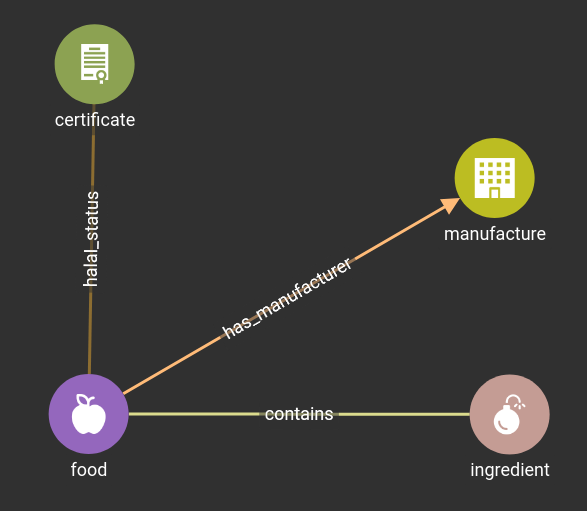
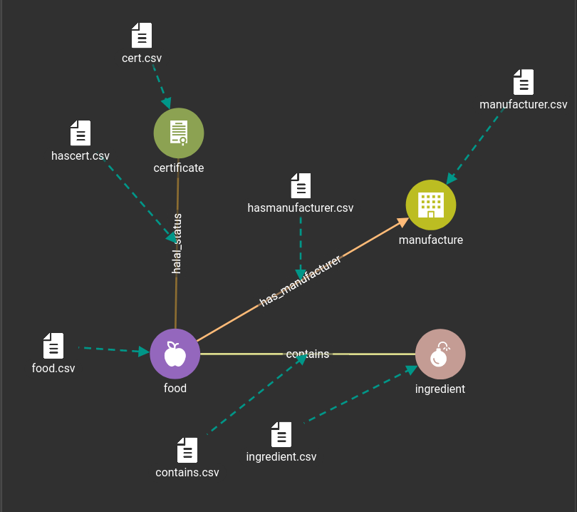

# Schema

## Vertex
* food : id, food_name
* ingredient : id, name
* certificate : id, organization, number
* manufacture : id, manufacture_name

## Edges
* halal_status
* has_manufacturer
* contains

# Data Mapping

all the CSV files can be found  [dataset](dataset) directory
